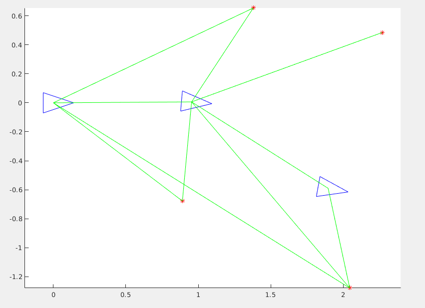

# Graph-SLAM-MATLAB
Graph SLAM assignment with MATLAB code 

## Primer funcionament
Per a fer funcionar primer el graph-SLAM, he posat distàncies una mica arbitràries. El resultat ha sigut el següent:

Encara s'han d'ajustar les distàncies correctament respecte al dibuix inicial.

## Ajustament de distàncies

He ajustat les distàncies i angles dels factors segons el mapa. Les covariances les he mantingut iguals a totes les mesures (factors), tant de moviment com de landmark (al principi les que vam posar a classe)

Covariances moviment:

x: 10 cm

y: 10 cm

angle: 2º

Covariances Landmarks:

distància: 1cm

angle: 5º

El resultat és el següent:

Veiem que l'estat 2 queda una mica allunyat de la posició on hauria d'estar, veiem que la mesura 6, al tenir una covariança petita estreny aquesta última part del sistema cap a on creu que hauria d'estar.

## Ajustament de covariances

