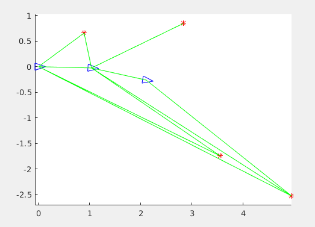

# Graph-SLAM-MATLAB
Graph SLAM assignment with MATLAB code 

## Primer funcionament
Per a fer funcionar primer el graph-SLAM, he posat distàncies una mica arbitràries. El resultat ha sigut el següent:

Encara s'han d'ajustar les distàncies correctament respecte al dibuix inicial.

## Ajustament de distàncies

He ajustat les distàncies i angles dels factors segons el mapa. Les covariances les he mantingut iguals a totes les mesures (factors), tant de moviment com de landmark. Per als landmarks de distància he posat una covariança d'1cm, degut a que he comès aquests errors expressament (no he mesurat al mil·límetre la distància, si no que he fet mesures més aproximades). Per a l'angle he posat una covariança 10 graus, ja que he comès les mateixes imprecisions que amb la distància. Les covariances de moviment les he deixat amb els mateixos valors que vam posar a classe.

Covariances moviment:

x: 10 cm

y: 10 cm

angle: 2º

Covariances Landmarks:

distància: 1cm

angle: 10º

El resultat és el següent:

Veiem que l'estat 2 queda una mica allunyat de la posició on hauria d'estar, veiem que la mesura 6, al tenir una covariança petita estreny aquesta última part del sistema cap a on creu que hauria d'estar. També les covariances en x i y dels factors de moviment són bastant grans (10cm).

## Ajustament de covariances

Per tal d'ajustar millor el mapa, he variat les covariances en distància dels factors 8 i 9 a 3cm, degut a que és més probable que hagi fet més imprecisions en les mesures amb més distància. Les covariances en angle les he deixat igual com estaven. He incrementat la precisió de les mesures de moviment canviant la covariança en x i y a 3cm, per tal de que aquest estat 2 que ha quedat més avall sigui més restrictiu (ens creiem al final més aquesta mesura que no pas la mesura del landmark 6). El resultat final és aquest:

La solució s'adjusta bastant bé al mapa inicial que teníem. El landmark 6 potser queda una mica més amunt però en general és una bona solució.

